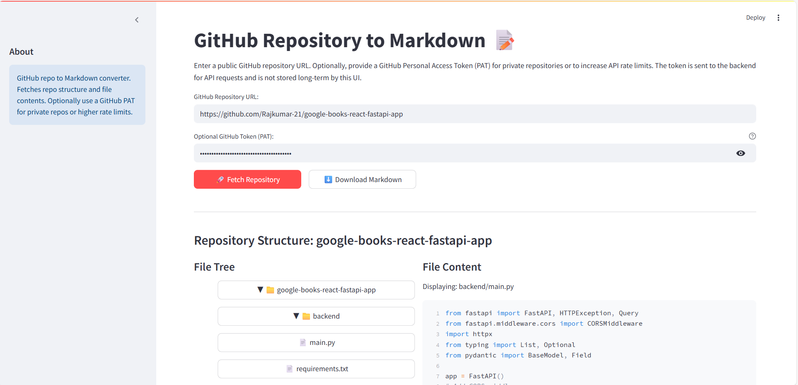

# Github2Markdown

A web application that converts GitHub repositories into well-formatted Markdown documentation, with an interactive UI for exploring repository contents.

## Sample Frontend


## Features

- Convert any GitHub repository into structured Markdown documentation
- Interactive file tree explorer
- Live file content preview with syntax highlighting
- Download complete repository documentation as Markdown
- Support for private repositories via GitHub Personal Access Tokens
- Handles binary files appropriately

## Tech Stack

- **Frontend**: Streamlit
- **Backend**: FastAPI
- **Containerization**: Docker & Docker Compose
- **Python**: 3.13+

## Quick Start

1. Clone the repository
2. Set up environment variables:
   ```bash
   # Create .env file in backend directory
   GITHUB_TOKEN=your_github_personal_access_token_here
   ```

3. Run with Docker Compose:
   ```bash
   docker-compose up --build
   ```

4. Access the application:
   - Frontend: http://localhost:8501
   - Backend API: http://localhost:8000

## Development

Project structure:
```text
Github2Markdown/
├── backend/
│   ├── app/
│   │   ├── main.py      # FastAPI application
│   │   └── models.py    # Pydantic models
│   └── Dockerfile
├── frontend/
│   ├── app_streamlit.py # Streamlit UI
│   └── Dockerfile
└── docker-compose.yml
```

## License

MIT License - See [LICENSE](LICENSE) file for details.